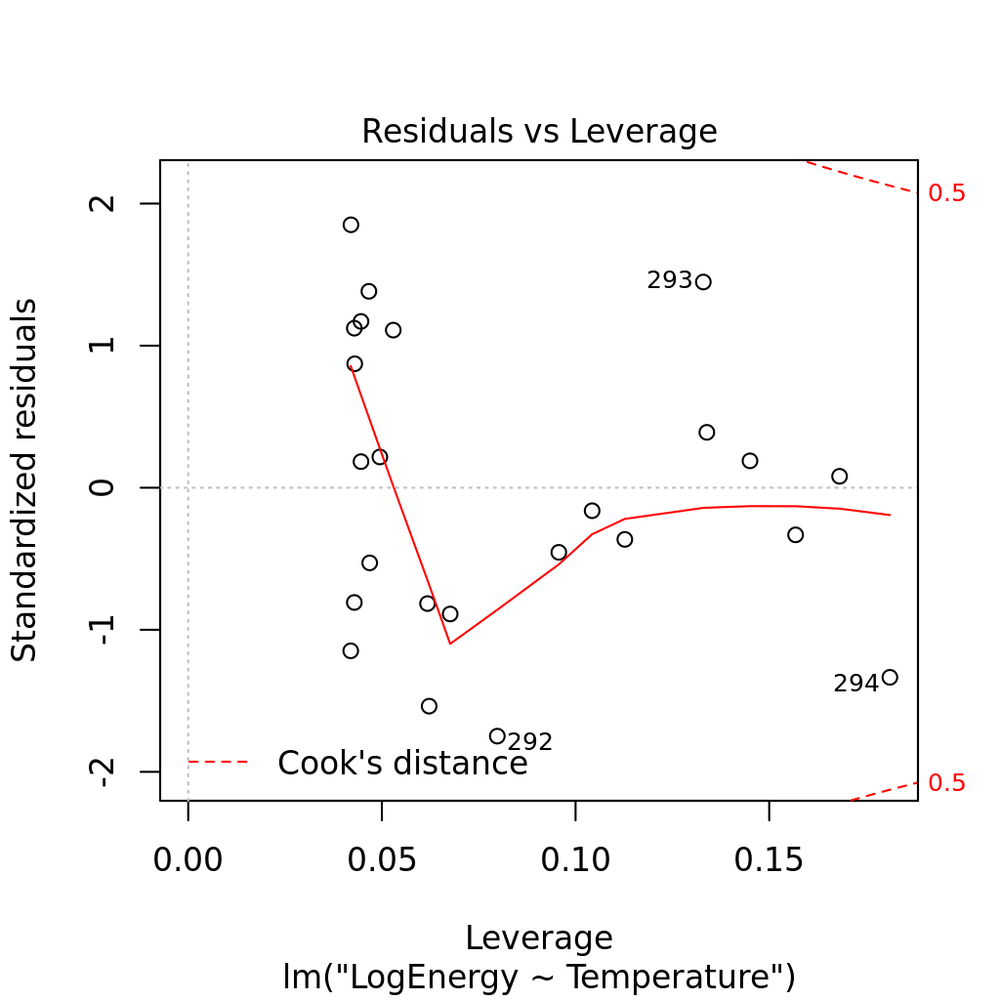

# **Statistical Modeling Final Project**
Jeffrey M. Moore

Introduction
=========================================================

Given two consecutive, random years of average monthly temperature data
for fifty-one US cities, as well as the monthly electricity usage for
those cities during those years, I will be constructing a statistical
model to predict a third year of monthly electricity usage for Denver,
Colorado given its average monthly temperature for that year. I will
start by exploring the data in
Section Explore, then I will discuss my model selection process
in Section Model. I will then discuss the results and analyses of
the model in
Section Results and summarize my conclusions in
Section Conclusion.

Exploratory Analysis
=======================================================================

In order to visualize the data, I plotted the temperature and
electricity usage (from here on referred to as energy usage) as a
function of time for both years (see
Fig. 2. The approximate trend appears to be that
temperatures are lowest in December/January and highest in July/August,
and energy usage being lowest in July/August and highest in
December/January. While the structure of the time-series data is similar
between cities, the variance of temperature and energy usage differ
greatly across the population.

Visualizing the direct temperature/energy relationship, I plotted the
energy usage data as a function of temperature, while only
differentiating data by the year the data was taken (see
Fig. 1. While one year was quite a bit warmer
than the other, there appears to be one underlying relationship between
temperature and energy usage that remains static, which is good for a
model that proposes to predict the energy usage for a third, random
year.

### Figure 1
Energy usage (in 100 GWh) of cities over time for two random,
non-consecutive years.

### Figure 2
Average monthly temperature (in deg. Celsius) of cities over time
for two random, non-consecutive
years.

It is also clear given the structure of the data that the relationship
between temperature and energy usage is non-linear, and exhibits what
appears to be an exponential increase in energy usage as temperatures
get lower. Assuming that the relationship is, in fact, exponential with
respect to temperature, this suggests that a logarithmic transformation
of the data by the function g(y) = ln(y+1) could be used to linearize the data. Plotting the
relationship between g(energy usage) and temperature, the
transformed data appears well suited for a linear model, especially when
considering observations from the city of Denver independent of other
cities, as I'll discuss further in the next section.

### Figure 3
Plots of the relationship between energy usage (in hundreds of GWh) vs
temperature (deg. Celcius) with observations segregated by year. The
first plot visualizes the raw relationship, whereas the second explores
the transformed (logarithmic)
relationship.

### Figure 4
Linear regression fit and confidence intervals for the transformed
energy usage vs temperature data for Denver, CO
only.

### Figure 5
Linear regression fits for the transformed energy usage vs temperature
data for select cities independent from other cities'
data.

### Figure 6
A box plot summarizing the behavior of the overall population of
different cities when comparing transformed energy usage and
temperature. Observations of Denver stand out as outliers relative to
the behavior of the population, indicating a pooled model would not be
appropriate.

Model Selection
============================================================

Since the goal of the model is to predict data for Denver, Colorado, I
begin by first examining how a simple linear regression performs on the
log-transformed energy vs temperature data.
Fig. 4 demonstrates the strength of this
transformation. Qualitatively, the transformed data linearizes the
Denver data very nicely, and a linear regression for Denver alone
results in a R^2 value of 0.94. In addition, the residuals plotted
vs fitted values
(Fig. 7) is nicely distributed, suggesting that
the assumption of linearity is valid. Furthermore, a Q-Q plot
(Fig. 8) comparing the theoretical quantiles tells us
that the assumption of normality is also upheld. Lastly, a leverage plot
(Fig. 9) shows that there are no observations
for the city of Denver that are leverage points. All this builds a
reasonable case that a very simple model that only considers
observations from Denver should be considered.

### Figure 7
Residuals vs fitted values.

### Figure 8
Normal Q-Q plot.

### Figure 9
Leverage plot.

Given that the overall trend of the energy/temperature relationship is
preserved across different cities (as seen in the exploratory analysis)
it would be helpful to use that data to capture the underlying structure
(as well as variability) into our model. To verify that the
transformation in equation g(y) = ln(y+1) is suitable for the aggregated city data, I repeated
the diagnostics described above for the pooled city model, and found no
signs of linearity or normality violations, nor considerable leverage
points. However, as can be see in
Fig. 5, the data for different cities does not
exhibit identical behavior as that seen in the trend for Denver. In
fact, comparing the trend for Denver to a pooled model in a box plot
(Fig. 6), the Denver observations appear to be
outliers relative to the average trend of the aggregated data. It's
therefore clear that a pooled model would not provide an accurate
prediction for the city of Denver.

However, it would not do to simply discard the information provided by
other cities. Instead, it would be best to incorporate all the data into
a hierarchical model. Given that both the temperature dependence and
intercept of the data depends strongly on city, it would good to use a
mixed effects model with city-dependent random effects for both
temperature and intercept. This way we can use the data of all cities to
inform how variable we might expect future data to be, while our
predictions will best fit the trend that Denver has seen historically.
Our model in this case will be:

### Equation 1

where
E_{jk} is the energy usage (in hundreds of GWh) for city j at time
k, T_{jk} is the temperature (in deg. C) in city j at time k,
beta_0 and beta_1 are the fixed intercept and slope for the
population of cities, a_j and b_j are the differences of these
parameters for the specific city j, and e_{jk} is a noise term. This
model incorporates the best of both worlds---a mix between a simple, yet
well-fit model that only considers Denver's data for the purpose of
predicting more data from Denver, and a model that incorporates all the
data available from 50 other cities in the US.

Model Results and Analyses
=============================================================================

In order to fit the model described by
Eqn. 1,
I used the lmer function in R's lme4 package, including random
effects for both intercept and temperature by city. The function finds
the fixed effect values of
beta_0 = 2.94 +- 0.04, beta_1 = -0.078 +- 0.003, and each are
extremely significant with t-value magnitudes >25. The standard
deviations of the random effects based on city are 0.23 for the
intercept random effects and 0.02 for temperature.

For a goodness-of-fit criterion, I calculate Omega_0^2 (a kind of
pseudo-R^2) of the model by comparing the variance of the full model
with the variance of a fixed, intercept-only model
Omega_0^2 = 1-Var(M_{full})/Var(M_{null}). For this model, I find
Omega_0^2 = 0.84. Given the high variance in the data, I believe this
model explains an acceptable fraction. In addition, the residuals vs
fitted values are well-distributed without any sign of violations of
linearity.

The model parameters beta as well as the random effects
for the city of Denver, CO were used to make predictions given the
temperature data from Denver for the third year. These predictions, as
well as calculated prediction intervals, are shown in
Fig. . Included in the figure are the Denver
observations from previous years. As a sanity check, it is good to see
that all the previous observations fall into the range of the prediction
interval, and the predictions for the new temperature data seem
reasonable qualitatively.

In order to determine whether the random effects are significant, I
fitted two reduced models: one model with no random effects and one
model with only intercept random effects based on city. I then performed
a likelihood ratio test using R's anova function, and found that the
full model with random effects for both intercept and temperature was
extremely significant (p<2.2*10^{-16}), justifying the use of
random effects for both intercept and temperature.

To compare, I have also plotted the known Denver data from
previous years. Prediction intervals were calculated from both fixed
effects uncertainty plus the random effects variance by computing
XVX^T (where X is the matrix of the new Denver data, and V is the
variance-covariance matrix from parameters beta), as
well as adding the residual variance (note that this is the method
outlined by Ben Bolker at
http://bbolker.github.io/mixedmodels-misc/glmmFAQ.html ).
Conclusions and Future Extensions
=============================================================================================

There are several alternative approaches to the model I described above
that could be worth considering, at the risk of adding more complexity
to the model. Here I will list a couple alternative approaches that I
would explore in order to further optimize my model selection.

First, I could use a Box-Cox transformation to tune my transformation
function more finely, rather than the simple logarithmic transformation
described by g(y) = ln(y+1) . This would test my assumption that the energy usage
increases exponentially with colder temperatures. I could then compare
the performance of a mixed random effects model using both of these
approaches by comparing the model likelihoods.

Next, I could attempt to fit a generalized linear mixed effect model
using the Poisson family and compare that to my current approach. Since
there appears to be an increase in the variance of the data with
increasing temperatures, this would be a natural model to compare to my
current model.

Finally, I have not attempted to quantify any potential zero-inflation
in my data. Future approaches could do this by using more specialized R
packages that could account for zero-inflation and compare its
performance and likelihood to models without this consideration.

Given the significance of the random effects for the mixed effects
model, goodness-of-fit (respectable Omega_0^2), qualitative
performance of the calculated prediction interval compared to historical
data, I believe the model described above is a good balance between
simplicity and complexity. I am reasonably confident in the accuracy of
its performance and simultaneously curious to see how my predictions
would measure up to the truth.
