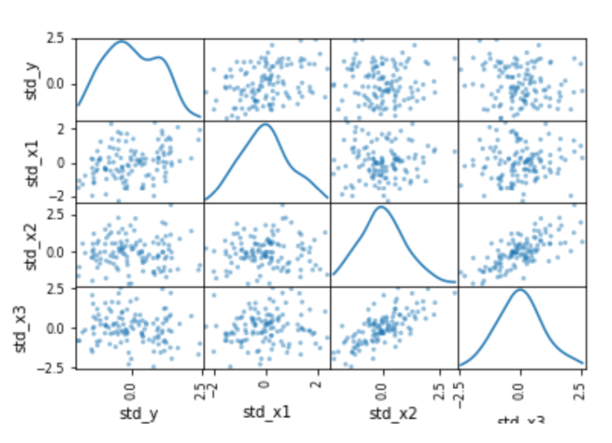
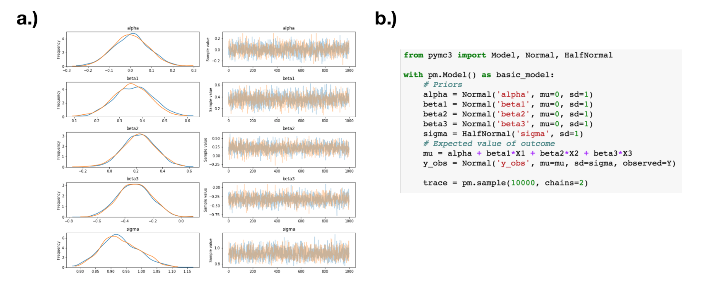
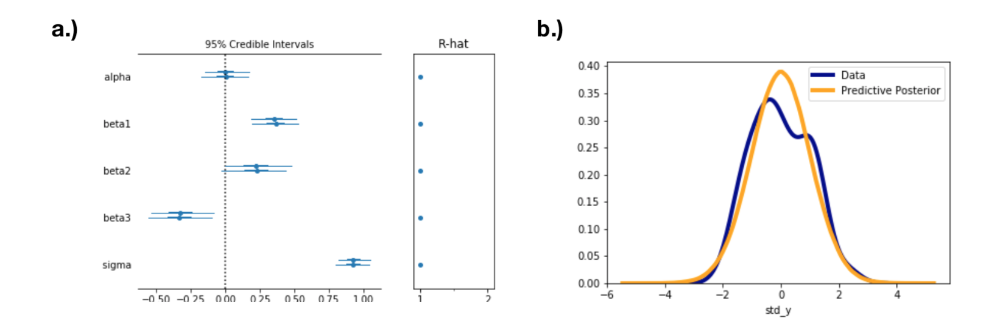
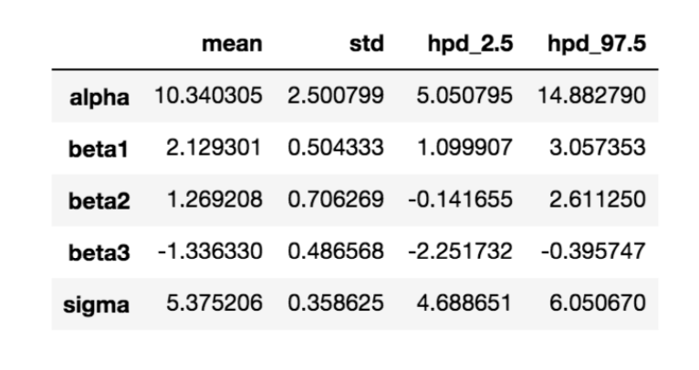
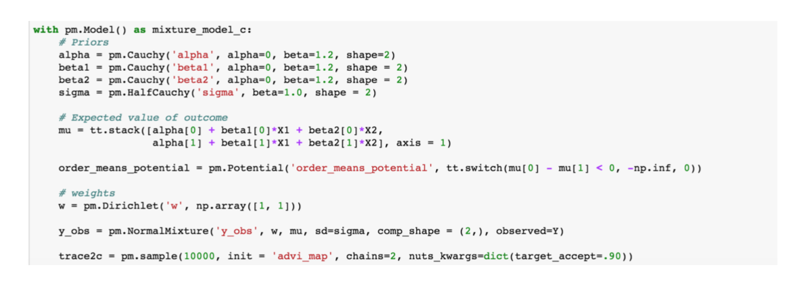
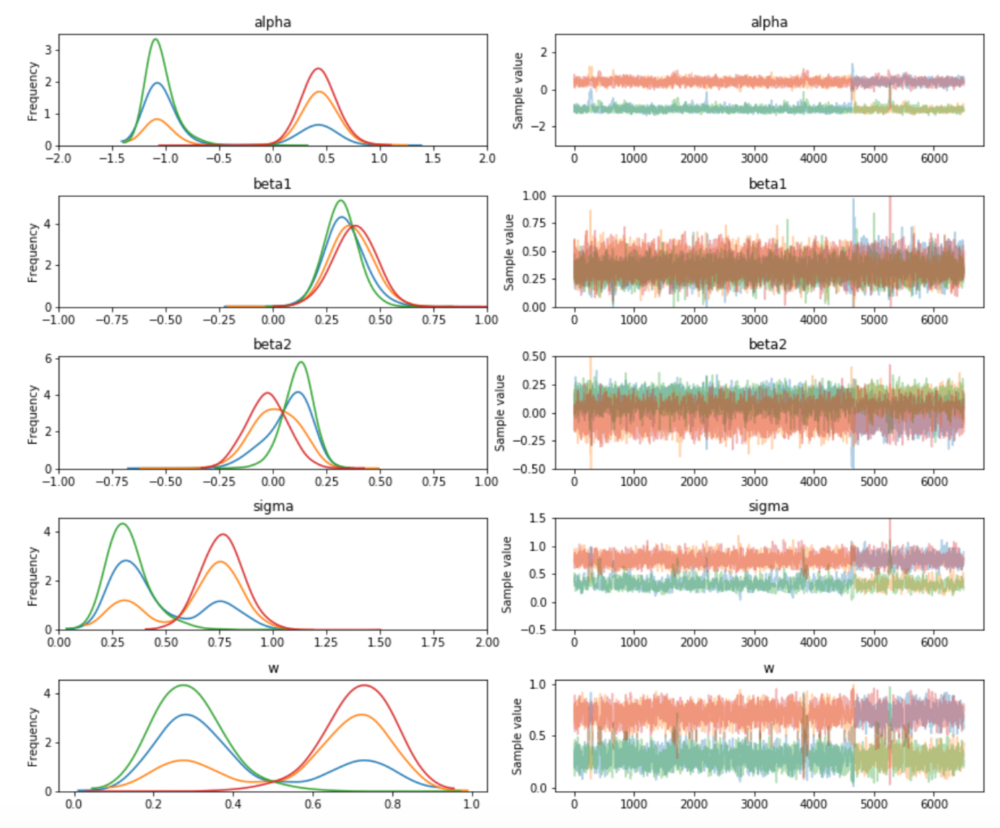
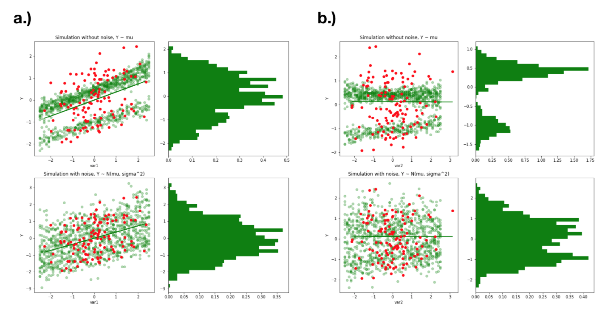
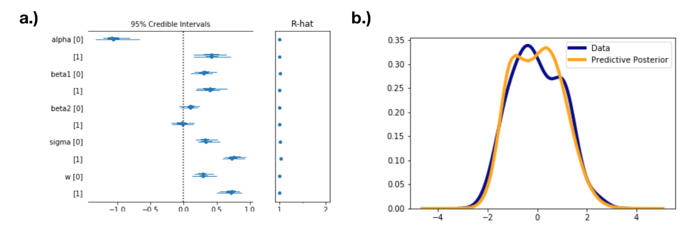
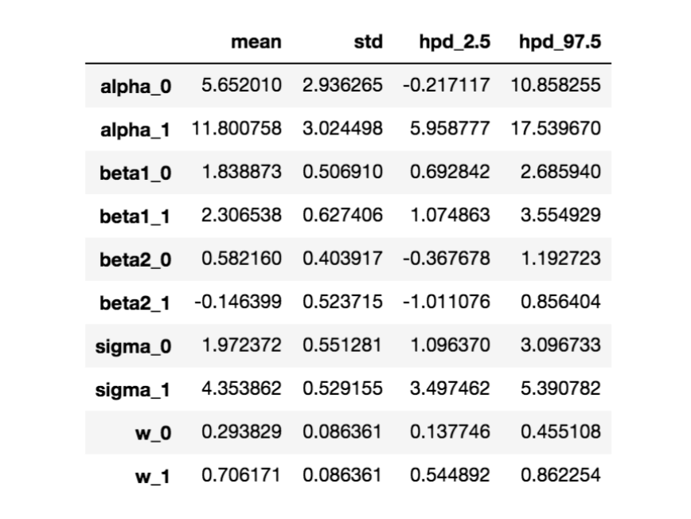

# Using MCMC to Explore Unknown Data

Lindsay Sonderhouse and Jeffrey Moore

We construct a model to fit data whose origin is unknown. The data is modeled
using multiple linear regression with a two component Gaussian mixture model, obtained through MCMC
simulations. The model uses Cauchy priors for the intercepts and slopes. Importance sampling is used to perform a sensitivity analysis on the priors. Comparisons with a single component Gaussian model and extensions of the two component mixture model are discussed.

## Exploratory Analysis

The provided data has three explanatory variables (x1, x2, x3) and one output, Y. A scatter plot for the standardized data is shown in Fig. 1, which shows the dependence of each variable on each other variable, as well as a density estimation for each variable along the diagonal. The plot shows that while the explanatory variables are roughly normal (although x1 seems to have a fatter tail with potentially a second mode peaked near x = 1), the output has two modes. In addition, the dependencies look linear, with a variance that is fixed as a function of the explanatory variables. These factors suggest that we should model the data using multiple linear regression, where Y follows a normal distribution with potentially more than one mixture component. That is,

Y ∼ ∑ w_i * N(μ_i,σ_i^2),

where μ_i=α_i + β_1i * x_1 + β_2i * x_2 + β_3i * x_3 and

∑ w_i = 1.

We also note the correlation between x2 and x3, which has a Pearson correlation coefficient of 0.7.

### Figure 1: Scatter plot showing standardized variable dependencies and a density estimation of each variable on the diagonal.

## Single component Gaussian model

We will first fit the data using a single component, so that Y ∼ N(μ,σ^2). We use N(0,1) for priors onα and β_i, chosen by looking at the data. We use HN(0,1), a half normal, for our prior on σ^2. The model is determined through an MCMC algorithm in PyMC3 [1] in Python, using two chains with 10,000 samples each. PyMC3 accommodates multiple types of MCMC algorithms, but it’s default algorithm is the No U-Turn Sampler (NUTS), a modification of the Hamiltonian Monte Carlo algorithm that uses adaptive step sizes [2]. The algorithm is initialized by starting with an identity mass matrix, whose diagonal elements are adapted based on the variance of the tuning samples. In addition, jitter is added to the starting points to add noise to the start of the MCMC chain. The algorithm assigns a burn-in of 500 samples. The autocorrelation quickly dies off after a few samples.

Thus, we take our thinning parameter to be 10. The thinned output of the MCMC algorithm as well as the Python code is shown in Fig. 2, while the mean and HPD for each of the variables is summarized in Fig. 3 (a).

### Figure 2 a & b

MCMC algorithm modeling the data asY∼N(μ,σ^2 ) withμ=α+β_1 * x_1 +β_2 * x_2 +β_3 * x_3. 
(a) Trace output of the MCMC algorithm. (b) Code used for the MCMC algorithm in PyMC3.

With this model, we can obtain the posterior predictive. PyMC3 has a simple function that will do this for us called sample posterior predictive. Given a number of samples nsample, it randomly picks parameter values determined by the MCMC algorithm and looks at Y determined from these parameters. It iterates this nsample times. We look at the density estimation for this given nsample = 5000, shown in Fig. 3 (b). Predictably, the posterior predictive does not capture the bimodality of the data. An estimate of the WAIC gives 321. Finally, a table showing the summary of each of the variables, reverted back to the original scale, is shown in Fig. 4.

### Figure 3 a & b

Results of the single component normal model. (a) Summary of the MCMC output. (b) Density plots for the data (blue) and the posterior predictive (orange).

### Figure 4: Unstandardized results of the single component normal model.

## Two component mixture model

To capture the bimodality of the output, we implement a two-component Gaussian mixture model. We use Cauchy priors for the intercept and slopes, and a half Cauchy forσ, since Cauchy distributions have fatter tails and thus are able to sample more of the parameter space [3]. In addition, we use the Dirichlet distribution for the weights.

Due to the correlation between var2 and var3, we remove var3 to help with model convergence. We validate this decision by repeating the MCMC simulation with var3 instead of var2, and find a similar predictive posterior.

The PyMC3 code for the mixture model is shown in Fig. 5. Importantly, the code shows the means weighted through the ordermeanspotential. This helps keep our modes well separated as a function of iteration number.

We use 2 chains with 10,000 iterations to simulate our results. In order to get the algorithm to converge, the target acceptance probability had to be increased to .9, otherwise there were many divergences. In addition, we found that the algorithm was most likely to converge if we correctly initialized our chain. We used advimap to do this, which uses the maximum a posteriori (MAP) estimate as the initial starting point. This allowed convergence ∼70% of the time. An alternative to this is approach is to provide the MCMC algorithm with a deterministic random seed. Each random seed, which is a number 2n, contains a random initial condition based on the particular random seed number. Providing the MCMC algorithm with a given random seed then deterministically sets the starting condition to be that initial condition. The user could then try different random seeds on small sample sizes to see if the algorithm converges, then use that random seed for longer chains afterwards.

## Figure 5: PyMC3 code for the two-component mixture model.

The trace summary of the MCMC results are given in Fig. 6. This trace removes a burn-in period of 2, iterations, and is un-thinned. Each variable shows label switching between the different modes, a sign that we have explored the entire parameter space. To analyze our results, we take the data from iteration number 500 to 2500, where the each parameter stays in one mode. We then thin the data with a thinning parameter of 50, determined through an autocorrelation plot. With this data, we confirm convergence by looking at the Gelman-Rubin statistic, which is close to 1 for each parameter.

To intuit the results of our model, we simulate the data by randomly selecting anα,βi,w, andσfor each component. Then, for a given x1 or x2, we flip a coin with weightwto choose which component it belongs to.

The results of this simulation is given in Fig. 7, which shows the simulation results (green) and the data (red),

### Figure 6

MCMC summary of the two-component mixture model. Un-thinned data is shown with a burn-in period of 2,000 samples removed. with the noise termσand without. We also show a histogram of the simulation, integrated over all x1 or x2.

From this simulation, the role of the noise termσis obvious. The simulation results without this term show two separate lines given by the linear regression of the two components, with a variance given by the variance of the parameters α,β, and w. However, it does not explain the variance of the data. With the addition of the noise term σ, this is alleviated. The code for the simulation results is listed in the Appendix.

A summary of the MCMC results are given in Fig. 8 (a), while an estimate of the posterior predictive is shown in Fig. 8 (b). The model seems to fit the tails of the distribution well, but the peaks are not well determined by the model. Indeed, trying to model the data by hand, we find that we cannot simultaneously model the tails and the peaks with only two components. This may suggest that there is a third and fourth component in the wings of the distribution near y = 3 and y = -2. An estimate of the WAIC gives 314. We confirm that our priors are not heavily weighting the model by doing sensitivity analysis using importance sampling. We change the priors of α_0 and α_1 , where the index corresponds to the component number, to Cauchy(1,10) and Cauchy(-.5,10), respectively.

Looking at the distribution ofα 0 andα 1 afterwards show that these parameter results are not very sensitive to the prior. A summary of the unstandardized parameters determined by the two-component mixture are given in Fig. 9.

### Figure 7 a & b

Simulation of the data given the MCMC results for the two-component mixture model, showing the output Y as a function of var1 (a) and var2 (b). The data is shown in red, while the simulation results are shown in green. A histogram of the simulation results are shown alongside the data.

## Model Comparison

To compare the models, we compute the WAIC, which gives 321 for the single component Gaussian model, and 314 for the two-component Gaussian model. This implies that the two-component model provides a better fit of the data than the single-component model.

### Figure 8 a & b

MCMC simulation results of the two-component Gaussian mixture model. (a) Summary of the parameters determined by the MCMC algorithm. The indices correspond to the two different Gaussian components, while the two lines show results for the two different chains. (b) Density plot of the data and the posterior predictive, determined by the MCMC algorithm.

## Model Extensions

Our two-component mixture model cannot model the peaks as well as the tails of the distribution, suggesting that there are additional components in the ideal model. An extension of this model could include three or four components in the mixture to see if this better fits the data. A robust way to determine the number of components in the dataset is to include a large number of weights, say ten, and see how many components have weights that are not zero. This would allow us to determine how many weights we should use to model the data.

With many components, it becomes much more important to separate the priors for the different components to ensure convergence and isolated modes. We briefly tried a three component mixture model, but could not find a good initial condition (even with more separated priors). We think finding a random seed that would give me convergence with only 1,000 samples would’ve been a good method to get the algorithm to work, which we would’ve done if we had more time.

Figure 9: Unstandardized MCMC results of the two-component mixture model

## References

[1] J. Salvatier, T.V. Wiecki T.V., and C. Fonnesbeck, PeerJ Comput Sci. (2016).

[2] M. Hoffman and A. Gelman, J Mach Learn Res., 15 , 1593-1623 (2014).

[3] A. Gelmanet al., Ann Appl Stat., 2 , 1360-1383 (2008).

